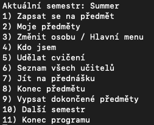

# Vysokoškolský systém v C# jako konzolová aplikace
Jedná se o úkol, který jsem měl zadaný při mé stáži ve firmě B2A.

Konkrétně se jednalo o implementaci vysokoškolského systému v konzolové aplikaci v jazyce C#.

Zadáním bylo:

- Studenti se zapisují na předměty vypsané pro konkrétní semestr a při jeho ukončení obdrží hodnocení.
- Každý předmět vyučuje jen několik učitelů, z nichž jeden je vždy garantem předmětu.
- Zároveň jeden učitel může vyučovat více předmětů.
- V rámci předmětu rozlišujeme přednášky a cvičení, ve kterých jsou studenti rozděleni do skupin.
- Předmět má předem stanový počet kreditů za jeho splnění a může mít jiné předměty jako své prerekvizity.
- Student nemůže ukončit studium, dokud nezíská potřebné množství kreditů.

Veškerý kód je okomentovaný.

# Ukázka


## Možnosti u studenta
- Zapsat se na předmět
- Zobrazit své předměty
- Udělat cvičení
- Zobrazit seznam všech učitelů
- Jít na přednášku
- Ukončit předmět
- Vypsat dokončené předměty

## Možnosti u učitele
- Zapsat se na předmět
- Zobrazit své předměty
- Vytvořit nový předmět
- Vytvořit nové cvičení
- Zobrazit seznam všech učitelů
- Průměr všech známek u studentů
- Vytvořit novou přednášku
- Zobrazit seznam všech přednášek
- Zobrazit seznam všech předmětů

# Spuštění
Ve složce projektu
```
dotnet run
```

# Sestavení (build)
Ve složce projektu
```
dotnet build
```
